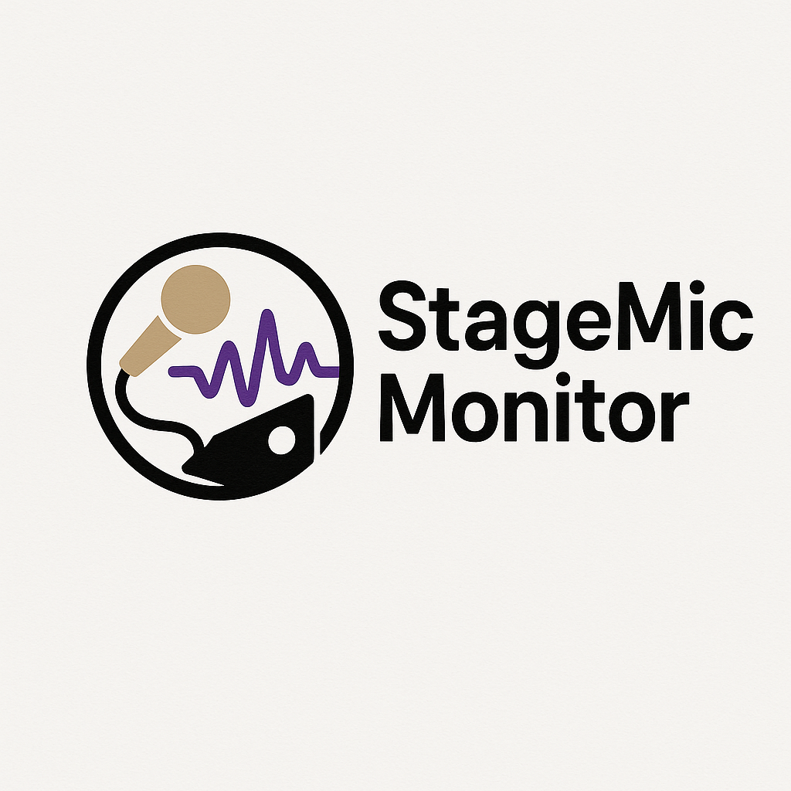

# StageMicMonitor

StageMicMonitor is a C++ audio backend designed to monitor radio microphones backstage during theatre productions. It aims to detect audio artifacts such as popping, hissing, and other interference using AI techniques to ensure high-quality audio output.

## Features (Planned)

*   Real-time audio monitoring from specified input devices.
*   AI-powered detection of common audio artifacts (popping, hissing, dropouts, etc.).
*   Console-based interface for status updates and alerts.
*   (Future) Configurable sensitivity and artifact types.

## Getting Started

These instructions will help you get the project set up on your local machine if you wish to contribute or explore the codebase.

### Prerequisites

*   A C++ compiler that supports C++17 (or later).
*   CMake (version 3.22 or higher).
*   Git.
*   (Optional, for some systems/IDEs) A C++ development environment like Visual Studio, Xcode, or VS Code with the CMake Tools extension.

(Detailed build instructions will be added as the project matures.)

## Usage

(Details on how to run and use the application will go here once the core functionality is implemented.)

## Contributing

(Details on how to contribute to the project will be added in the future.)

## License

This project is licensed under the GNU General Public License v3.0 - see the `LICENSE` file for details.

---

*README last updated: May 16, 2025*

